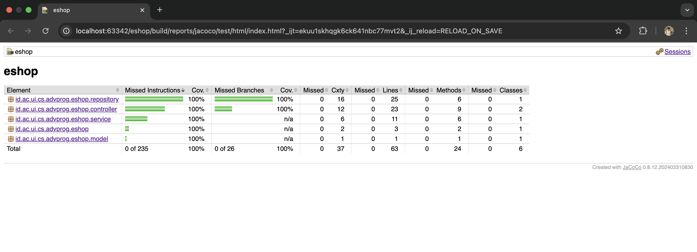

# Advance Programming Course

This repository contains the modules, tutorials, and exercises for the Advance Programming Course.

## Deployment Link

- https://fit-liuka-dafandikri-910b7eeb.koyeb.app/

## Table of Contents

1. [Module 1](#module-1)
2. [Module 2](#module-2)
3. [Module 3](#module-3)
4. [Module 4](#module-4)

## Module 1 - Coding Standard <a id="module-1"></a>

## <ins> Reflection 1 </ins>

### Clean Code Principles

- **Meaningful Names**: Class and method names clearly reflect their purpose.
- **Functions**: Controller methods are focused on single, well-defined tasks (for example, creating or editing a product).
- **Comments**: Kept minimal by using self-explanatory names and concise docstrings where necessary.
- **Data Structures**: Product objects store only the relevant fields for a product, using clear getters/setters.
- **Error Handling**: With bean validation enabled, we handle null or invalid inputs by returning early and directing users back to the form.

#### Example Code Snippet – Creating a Product

Below is an example of a controller method showing how we handle a new product creation request. We validate user input via bean validation (e.g., checking that the product name is not blank and quantity is ≥ 1). If validation fails, we return to the creation form; otherwise, we create the product and redirect to the product list:

```java
@PostMapping("/create")
public String createProductPost(@Valid @ModelAttribute Product product,
                                BindingResult result,
                                Model model) {
    if (result.hasErrors()) {
        // Return back to the create form if validation fails
        return "createProduct";
    }
    service.create(product);
    return "redirect:list";
}
```

And here is a simplified HTML form (using Thymeleaf) that users fill out to create the product. Notice how the form fields map directly to the `Product` class fields:

```html
<form th:action="@{/product/create}" th:object="${product}" method="post">
  <div class="form-group">
    <label for="nameInput">Name</label>
    <input
      th:field="*{productName}"
      type="text"
      class="form-control mb-4 col-4"
      id="nameInput"
    />
  </div>
  <div class="form-group">
    <label for="quantityInput">Quantity</label>
    <input
      th:field="*{productQuantity}"
      type="text"
      class="form-control mb-4 col-4"
      id="quantityInput"
    />
  </div>
  <button type="submit" class="btn btn-primary">Submit</button>
</form>
```

By combining clear naming, concise validation rules, and straightforward form rendering, we keep our code both readable and reliable.

### Secure Coding Practices

- **ID Generation**: We assign a UUID if none is set to prevent ID collisions.
- **Validation (Future Improvement)**: Bean validation can be extended (e.g., more specific constraints).
- **Authorization (Future)**: Restrict certain endpoints to authorized roles.
- **Output Data Encoding (Future)**: Encode data to mitigate XSS, especially in dynamically rendered fields.

### Possible Improvements

- Add more comprehensive exception handling for invalid edge cases.
- Increase test coverage (unit and functional tests) to ensure that changes do not break existing features.

---

## <ins> Reflection 2 </ins>

After creating unit tests, I feel more confident about the application’s reliability. Tests act as an early warning system—if something changes or breaks, the tests can catch it quickly. We typically decide on the number of tests by looking at the class’s complexity and the range of scenarios to be verified. Code coverage tools can reveal untested lines or paths, but 100% coverage alone does not guarantee bug-free code.

With our new functional test suite, aimed at checking product creation and count on the list page, here are some key considerations for code cleanliness:

1. **Potential Duplication**

   - Repeated setup or teardown logic scattered across test classes can reduce clarity.
   - Centralizing common steps in a base test class or utility methods aids maintainability.

2. **Hard-Coded Values and Shared State**

   - Overusing fixed values (e.g., product IDs, names) can hamper readability.
   - Generating random or parameterized test data often leads to clearer, more robust tests.

3. **Single Responsibility in Tests**

   - Tests documenting multiple scenarios at once can be confusing.
   - Each test should validate one primary condition. This helps speed up debugging when a test fails.

4. **Readability and Naming**

   - Clear, descriptive test names (e.g., `shouldCreateProduct_whenValidData`) boost understandability
   - Consistent naming conventions reinforce a coherent testing strategy across the project.

5. **Test Data Management**
   - Utility methods for creating or resetting sample data can reduce code clutter while still respecting “Arrange, Act, Assert.”
   - Overly repeated creation steps can be refactored into either `@BeforeEach` or dedicated helper methods.

**Suggestions for Improvement**:

- **Use a Base Functional Test Class**: Move common testing logic (driver setup, teardown, or repeated form fill steps) into a parent class.
- **Maintain Meaningful Test Names**: Let the test name explain the condition verified and the expected outcome.
- **Keep an Eye on Coverage—but Don’t Rely on It Alone**: Use code coverage to find untested areas but remember that executed code isn’t necessarily fully tested.

---

## Module 2 - CI/CD & DevOps <a id="module-2"></a>

## <ins> Reflection 1 </ins>

### Code Quality Issues Fixed

**Wildcard Imports in Test Classes**

- **Issue**: Several test classes (`ProductServiceImplTest`, `MainControllerTest`, and `ProductControllerTest`) used wildcard imports (e.g., `import static org.mockito.Mockito.*`).
- **Fix**: Replaced all wildcard imports with explicit imports for specific classes and methods needed.
- **Strategy**:
  - Explicitly import only the required classes/methods
  - Improve code readability and maintainability
  - Make dependencies clear and traceable
  - Prevent potential naming conflicts
  - Example: Changed `import static org.mockito.Mockito.*` to specific imports like:
    ```java
    import static org.mockito.Mockito.when;
    import static org.mockito.Mockito.verify;
    import static org.mockito.Mockito.doNothing;
    ```

## <ins> Reflection 2 </ins>

### CI/CD Implementation Analysis

My current project successfully implements both Continuous Integration (CI) and Continuous Deployment (CD) practices:

**Continuous Integration (CI)**

- Implemented through GitHub Actions workflows (defined in `.github/workflows`)
- Automatically triggers on every push or pull request
- Features:
  - Automated test execution with 100% coverage
  - Static code analysis with PMD
  - Early detection of bugs and security vulnerabilities

**Continuous Deployment (CD)**

- Implemented using Koyeb as the deployment platform
- Features:
  - Automatic deployment triggered by repository updates
  - Direct deployment to production environment for main branch changes
- Current Implementation:
  - Uses Koyeb's Autodeployment feature instead of explicit GitHub Actions workflow
  - While not using push-based GitHub Actions (due to Koyeb free plan limitations), still achieves automated deployment
  - Successfully ensures latest version deployment after main branch updates

## Testing Report Code Coverage



## ## Module 3 - SOLID Principles Implementation <a id="module-3"></a>

## <ins> Reflection </ins>

### 1) What principles were applied to the project

#### Single Responsibility Principle (SRP)

The Single Responsibility Principle states that a class should have only one responsibility or reason to change. In our project:

- **Models (Car, Product)** are responsible solely for data structure and validation through annotations:

  ```java
  public class Car extends Vehicle {
      @NotBlank(message = "Car color cannot be blank")
      private String carColor;
      // ...
  }
  ```

- **Repositories (CarRepository, ProductRepository)** handle data persistence operations
- **Services (CarServiceImpl, ProductServiceImpl)** manage business logic
- **Controllers (CarController, ProductController)** handle HTTP requests and UI flow

This separation ensures that changes to one aspect of the application (e.g., validation rules) don't affect other aspects.

#### Open/Closed Principle (OCP)

The Open/Closed Principle states that software entities should be open for extension but closed for modification. In our implementation:

- Created a base **Vehicle** class that can be extended for different vehicle types without modifying existing functionality

- Used the **IdGenerator** interface to allow different ID generation strategies:

  ```java
  @Autowired
  private IdGenerator idGenerator;

  public Car create(Car car) {
      if (car.getId() == null) {
          car.setId(idGenerator.generateId());
      }
      // ...
  }
  ```

- Repository and Service interfaces that can be implemented in multiple ways

#### Liskov Substitution Principle (LSP)

The Liskov Substitution Principle states that objects of a superclass should be replaceable with objects of its subclasses without affecting program correctness. In our code:

- **Car** properly extends **Vehicle** with method implementations that maintain the contract:

  ```java
  public class Car extends Vehicle {
      // Proper inheritance with delegation methods
      public String getCarId() {
          return getId();  // Delegates to parent method
      }
      // ...
  }
  ```

- Delegation methods ensure backward compatibility while preserving the inheritance relationship
- A Car object can be used anywhere a Vehicle is expected without breaking functionality

#### Interface Segregation Principle (ISP)

The Interface Segregation Principle states that clients should not be forced to depend upon interfaces they do not use. Our implementation includes:

- **GenericRepository** interface for common repository operations
- **CarRepositoryInterface** extends GenericRepository for car-specific operations:

  ```java
  public interface CarRepositoryInterface extends GenericRepository<Car, String> {
      // Car-specific repository operations can be added here
  }
  ```

- Service interfaces defining focused sets of operations for different client needs

#### Dependency Inversion Principle (DIP)

The Dependency Inversion Principle states that high-level modules should not depend on low-level modules; both should depend on abstractions. In our project:

- Controllers depend on service interfaces, not implementations:

  ```java
  @Controller
  class CarController {
      @Autowired
      private CarService carService;  // Interface, not implementation
      // ...
  }
  ```

- Services depend on repository interfaces, not concrete classes:

  ```java
  public class CarServiceImpl implements CarService {
      @Autowired
      private CarRepositoryInterface carRepository;  // Interface, not implementation
      // ...
  }
  ```

- IdGenerator dependency is injected into repositories rather than directly instantiated

### 2) Advantages of applying SOLID principles to your project with examples

#### Better Maintainability

- **SRP Example:** When changing car validation rules, we only need to modify the Car class annotations, not the controller or repository logic.
- **OCP Example:** Adding a new vehicle type (e.g., Motorcycle) requires creating a new class that extends Vehicle, without modifying existing code.

#### Easier Testing

- **DIP Example:** The CarServiceImpl class can be tested with a mock CarRepositoryInterface, isolating service logic from repository implementation.
- **SRP Example:** Validation logic can be tested independently from persistence or business logic.

#### Improved Flexibility

- **ISP Example:** Different clients can use only the repository methods they need through specific interfaces.
- **OCP Example:** Different ID generation strategies can be implemented by creating new IdGenerator implementations without changing repository code.

#### Better Code Reuse

- **LSP Example:** Common functionality in the Vehicle class can be reused by all vehicle types without duplication.
- **DIP Example:** The IdGenerator can be reused across multiple repositories through dependency injection.

### 3) Disadvantages of not applying SOLID principles to your project with examples

#### Tight Coupling

- **Without DIP:** If CarServiceImpl directly instantiated CarRepository instead of using an interface, replacing the repository implementation would require changing the service code:
  ```java
  // Tightly coupled, hard to replace
  private CarRepository carRepository = new CarRepository();
  ```

#### Rigid Code

- **Without OCP:** Adding support for a new ID generation method would require modifying all repository classes directly.
- **Without SRP:** If validation, business logic, and persistence were all mixed in one class, a change to validation rules would risk affecting other aspects.

#### Testing Difficulties

- **Without DIP:** Testing would require setting up real repositories instead of using mocks, making tests complex and slow.
- **Without SRP:** Testing would require covering multiple responsibilities at once, leading to complex test setups.

#### Code Duplication

- **Without LSP:** Each vehicle type would need to implement common properties and behaviors independently, leading to duplicated code.
- **Without ISP:** Clients would need to implement methods they don't use, causing unnecessary complexity.

#### Harder Maintenance

- **Without SRP:** A change to validation rules could ripple through multiple classes if responsibilities aren't clearly separated.
- **Without OCP:** Adding new features would require modifying existing, working code, increasing the risk of introducing bugs.

## Conclusion

Applying SOLID principles to this e-shop application has significantly improved its structure, maintainability, and testability. The application is now more flexible and can accommodate changes and extensions with minimal modification to existing code. Though initially requiring more interfaces and classes, the long-term benefits in maintainability and extensibility far outweigh the initial investment in proper architecture.

## Module 4 - Test-Driven Development & Refactoring <a id="module-4"></a>

### Reflection

#### Self-Reflective Questions Based on Percival (2017)

##### Correctness

1. **Do I have enough functional tests to reassure myself that my application really works, from the point of view of the user?**

   From my perspective, **absolutely**, the test suite effectively covers crucial user interactions with orders - including creation, status modifications, and searching capabilities by both ID and author name. These represent the fundamental ways users interact with the order functionality. I've ensured that every method within the `Order` component has been verified through _**both positive and negative test scenarios**_, covering the full spectrum of use cases. This comprehensive approach gives me confidence that the core `Order` feature functions properly from an end-user standpoint.

2. **Am I testing all the edge cases thoroughly?**

   My test suite addresses various boundary conditions, including:

   - Orders created with no products in the list
   - Invalid status update attempts
   - Case sensitivity challenges when searching by author names
   - Scenarios involving non-existent orders for updates or lookups

   Being derived primarily from tutorial examples, I believe these edge cases provide sufficient code coverage for now. Though additional scenarios could be considered (perhaps testing character limit constraints for author names), the current coverage seems appropriate for the `Order` component's present implementation.

3. **Do I have tests that check whether all my components fit together properly? Could some integrated tests do this, or are functional tests enough?**

   My unit tests thoroughly examine individual components (model, repository, and service layers) in isolation. Given the interdependence between repository and service components, introducing modest integration testing would be valuable. Specifically, testing the complete order lifecycle from initial creation through final retrieval would verify that repository-service interactions function seamlessly together. While the current functional test coverage is adequate, incorporating targeted integration tests would strengthen overall system reliability.

##### Maintainability

4. **Are my tests giving me the confidence to refactor my code, fearlessly and frequently?**

   **Definitely**, my test suite serves as a robust safety net capturing the essential behaviors of the model, repository, and service layers. This comprehensive coverage empowers me to \*\*confidently restructure the `Order` class, modify the `OrderStatus` enumeration, and even rework repository implementations without fear of introducing regressions. Each refactoring phase concluded with successful test execution, confirming that no unintended side effects were introduced.

5. **Are my tests helping me to drive out a good design? If I have a lot of integration tests but less unit tests, do I need to make more unit tests to get better feedback on my code design?**

   The test suite has substantially shaped the design architecture, particularly regarding:

   - Implementing the `OrderStatus` enum, which emerged naturally from refactoring tests to eliminate repetitive string literals
   - Incorporating status validation within the `Order` class as suggested in the tutorial, enhancing data integrity
   - Using mocks for `OrderRepository` within `OrderServiceImplTest`, which reinforced proper separation between service and repository concerns

   Currently, there exists a healthy equilibrium between unit and functional tests, **HOWEVER** incorporating strategic integration tests would enhance reliability, especially if persistence mechanisms change (such as adopting a different database solution).

##### Productive Workflow

6. **Are my feedback cycles as fast as I would like them? When do I get warned about bugs, and is there any practical way to make that happen sooner?**

   The unit test execution for all components is remarkably swift - completing in under 50ms on my development machine, providing nearly instant feedback during coding sessions. Potential issues are identified almost immediately following code modifications, largely due to our disciplined **Red-Green-Refactor** TDD methodology. As system complexity increases, organizing tests into categories of "rapid unit tests" versus "more intensive integration tests" would help maintain these quick feedback loops.

7. **Is there some way that I could write faster integration tests that would get me feedback quicker?**

   The existing test suite primarily consists of unit tests utilizing Java's in-memory data structures (lists), which inherently execute quickly. Should we transition to persistent storage in the future, employing dedicated test databases for integration testing would likely deliver faster results compared to sharing a single external database configuration.

8. **Can I run a subset of the full test suite when I need to?**

   **Certainly**, IntelliJ's testing capabilities allow for executing specific test classes or individual test methods as needed. I frequently leverage this functionality during TDD cycles by running only tests relevant to the component I'm actively developing or modifying. This targeted approach significantly accelerates iteration cycles when focusing on particular system elements. While VSCode offers similar capabilities through extensions, IntelliJ provides superior native support specifically optimized for Java development workflows.

9. **Am I spending too much time waiting for tests to run, and thus less time in a product flow state?**

   **Not at all**, particularly since this represents tutorial code and because the current test suite executes exceptionally quickly, owing to:

   - Implementation using in-memory list structures for repository components
   - Limited external system dependencies
   - Strategic application of mock objects

   These optimizations preserve development flow by eliminating testing bottlenecks. For larger-scale projects, implementing selective test execution strategies would help maintain this productive state.

#### F.I.R.S.T. Principle Reflection

The F.I.R.S.T. principles provide an excellent framework for evaluating test quality. My assessment of the current test suite:

| Principle       | Evaluation                                                                                                                                                                                                                                                                                 |
| --------------- | ------------------------------------------------------------------------------------------------------------------------------------------------------------------------------------------------------------------------------------------------------------------------------------------ |
| Fast            | **Achieved** The majority of tests execute rapidly due to their focus on in-memory operations (such as `Order` validation logic). Even the `OrderServiceImpl` tests using Mockito remain performant since external dependencies are properly mocked rather than actually invoked.          |
| Independent     | **Achieved** Each test functions autonomously, with fresh `Order` and `OrderRepository` instances created through the `setUp()` method. Tests avoid dependencies on state from previous test executions, with the minor exception of shared `Order` status definitions.                    |
| Repeatable      | **Achieved** All tests yield identical results across multiple executions. By avoiding external dependencies, we've eliminated the common causes of test flakiness.                                                                                                                        |
| Self-Validating | **Achieved** Every test contains explicit assertions that directly verify expected outcomes (largely following tutorial guidance). No tests require manual verification through log inspection or system state evaluation.                                                                 |
| Timely          | **Partially Achieved** Certain tests, particularly for `OrderServiceImpl`, were implemented after partial service development rather than strictly adhering to TDD principles. An improvement would be consistently writing failing tests before implementing corresponding functionality. |
